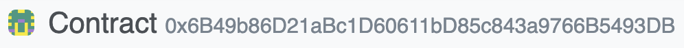
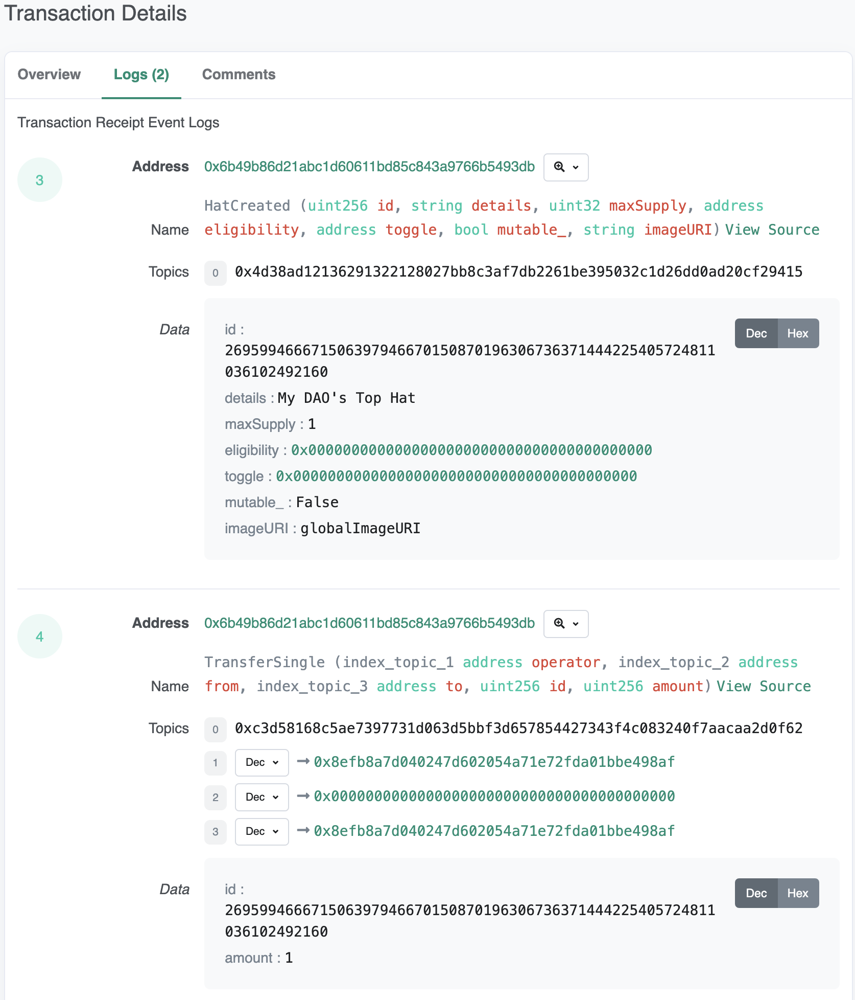
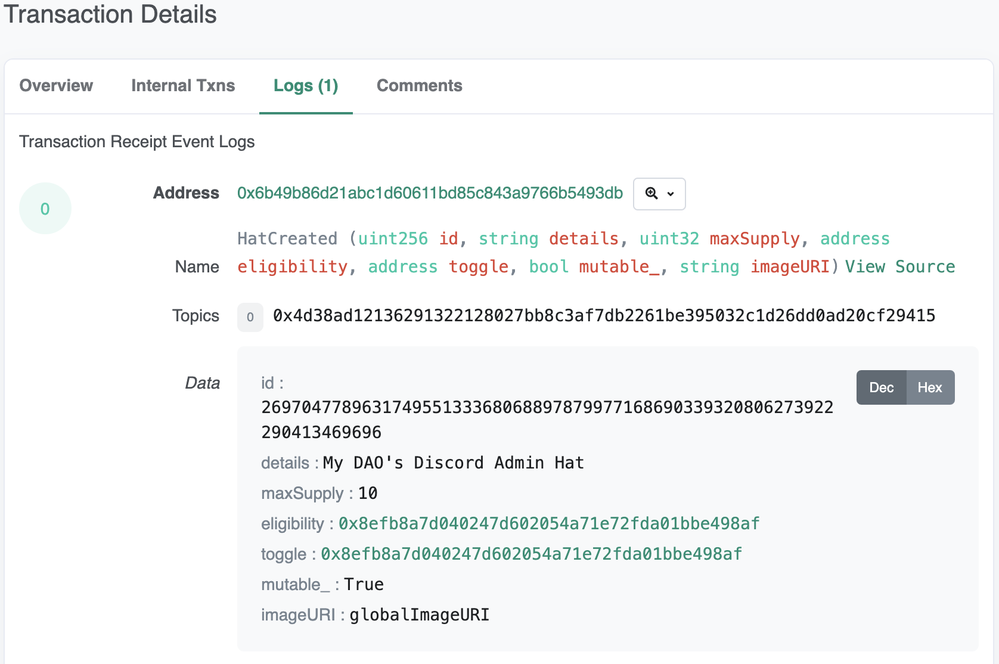
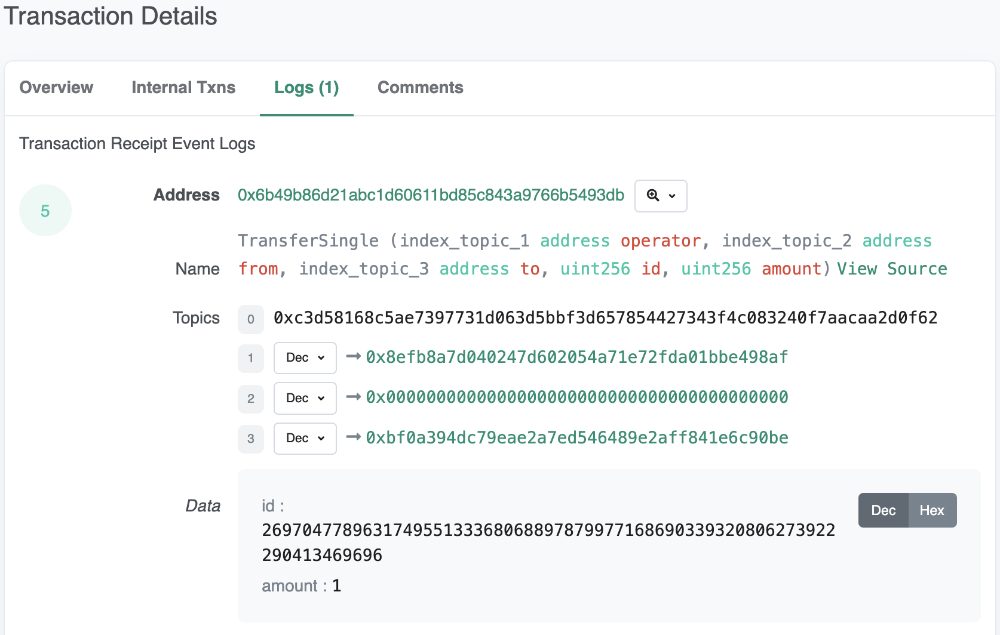
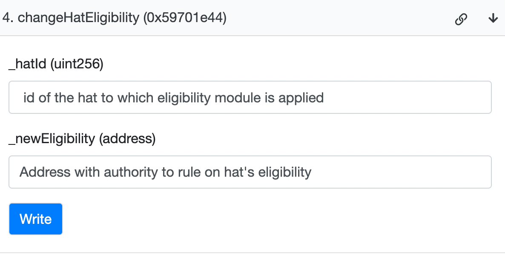
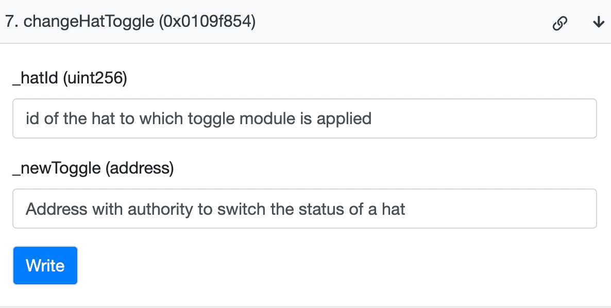
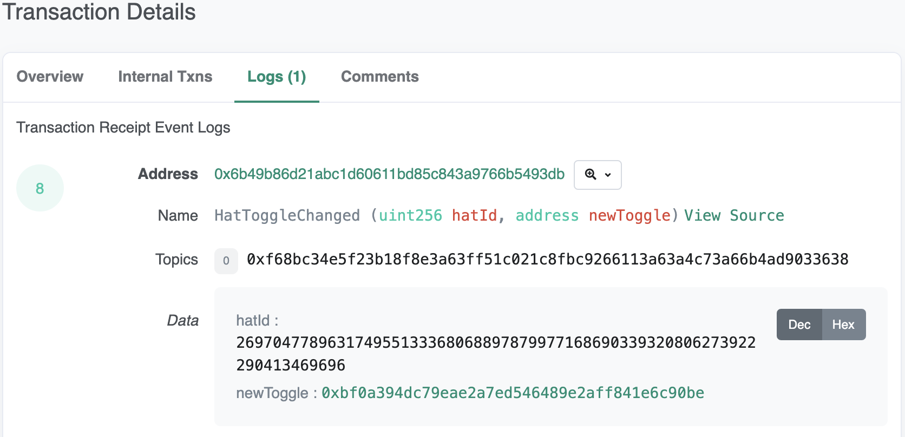
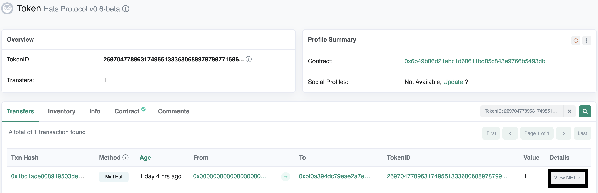

# Hats Protocol Self-Service Documentation

   DRAFT Last updated: 6 February  

_Please add comments as you use this draft guide for anything that you feel could be clarified, improved, or added — thank you!_

This self-service guide shows you how to _mint a tophat_, _create a hat_, and _mint a hat_ using a block explorer. It provides a basic introduction to and implementation of the _eligibility and toggle_ modules, as well as how to _token gating_ using hat ids.

The guide is based on Hats Protocol v0.6-beta. Network deployments and contract addresses are included in the Setup section below.
#### Hats Protocol v0.6-beta deployments

<table>
  <tr>
   <td><strong>Network</strong>
   </td>
   <td><strong>Address</strong>
   </td>
  </tr>
  <tr>
   <td>Goerli
   </td>
   <td><a href="https://goerli.etherscan.io/address/0xcf912a0193593f5cD55D81FF611c26c3ED63f924">0xcf912a0193593f5cD55D81FF611c26c3ED63f924</a>
   </td>
  </tr>
  <tr>
   <td>Polygon
   </td>
   <td><a href="https://polygonscan.com/address/0x95647f88dcbc12986046fc4f49064edd11a25d38#writeContract">0x95647f88dcbc12986046fc4f49064edd11a25d38</a>
   </td>
  </tr>
  <tr>
   <td>Gnosis Chain
   </td>
   <td><a href="https://gnosisscan.io/address/0x6B49b86D21aBc1D60611bD85c843a9766B5493DB#writeContract">0x6B49b86D21aBc1D60611bD85c843a9766B5493DB</a>
   </td>
  </tr>
</table>

_Images included from [Gnosisscan](https://gnosisscan.io/). However, this guide is chain-agnostic and the instructions are the exact same for [Polygonscan](https://polygonscan.com/) and [Etherscan](https://goerli.etherscan.io/)._

# Contents
- [tl;dr](#tldr) - _3-second tutorials of each action_
- [Setup](#setup) - _How to interact with hats via block explorer_
- [Mint a Top Hat](#mint-a-top-hat) - _Mint the root of your hat tree_
- [Create a hat](#create-a-hat) - _Create a hat with new responsibilities and authorities_
- [Mint a hat](#mint-a-hat) - _Assign a hat to an address_
- [Eligibility and toggle](#eligibility-and-toggle) - _Intro to Hats Protocol's most powerful module_
- [Token gating](#token-gating) - _Use hat id to gate access to external tools and applications_

# tl;dr
_Expand and collapse each section to see the 3-second tutorial to complete each action._

  
Mint a Top Hat

  

  
Create a hat

  

  
Mint a hat

  

# Setup
In this section you will connect your web3 wallet so you can interact with the Hats contract via block explorer.
## Step 1: Open the Hats contract on your desired block explorer
Hats v0.6-beta is deployed on three networks. Links to contracts below.
### Hats Protocol v0.6-beta deployments
<table>
  <tr>
   <td><strong>Network</strong>
   </td>
   <td><strong>Address</strong>
   </td>
  </tr>
  <tr>
   <td>Goerli
   </td>
   <td><a href="https://goerli.etherscan.io/address/0xcf912a0193593f5cD55D81FF611c26c3ED63f924">0xcf912a0193593f5cD55D81FF611c26c3ED63f924</a>
   </td>
  </tr>
  <tr>
   <td>Polygon
   </td>
   <td><a href="https://polygonscan.com/address/0x95647f88dcbc12986046fc4f49064edd11a25d38#writeContract">0x95647f88dcbc12986046fc4f49064edd11a25d38</a>
   </td>
  </tr>
  <tr>
   <td>Gnosis Chain
   </td>
   <td><a href="https://gnosisscan.io/address/0x6B49b86D21aBc1D60611bD85c843a9766B5493DB#writeContract">0x6B49b86D21aBc1D60611bD85c843a9766B5493DB</a>
   </td>
  </tr>
</table>

Confirm you see the Hats contract address at the top of the page:

  

_NOTE: Images included from Gnosisscan (Gnosis Chain), however, the instructions are the exact same for Polygonscan (Polygon), and Etherscan (Goerli)._

<!-- @nintynick to provide warning lanugage about connecting wallet -->
## Step 2: Select “Write Contract” in Contract section and connect wallet

> Hats is currently in beta and should be used at your own risk. We take security seriously and our contracts have been thoroughly tested but are pending audit and bugs may still exist.

  

You are now ready to interact with the Hats contract.

## Step 3: Proceed to your desired action
- [Mint a Top Hat](#mint-a-top-hat)
- [Create a hat](#create-a-hat)
- [Mint a hat](#mint-a-hat)

# Mint a Top Hat  
Minting a Top Hat creates the root of a new Hats tree. Hats trees can be very large, very small, or even just a single hat — but they all start with a Top Hat. 

Top Hats have special characteristics that distinguish them from other hat types:
- They are their own admin
- They are always immutable except they can change their own details and image fields*
- They can be linked*
- They can transfer themselves

*_These characteristics are new in v1_

You can mint a Top Hat with the `mintTopHat` function, which creates and mints a hat that is its own admin*, i.e. a `topHat`.

_*Note: New functionality is coming soon that will enable Top Hats and their associated trees to be linked and unlinked to other existing Hats trees, by changing the admin of a Top Hat._

## tl;dr

  
3-second tutorial to mint a Top Hat

  

## Step 1: Determine `mintTopHat` parameters

<table>
  <tr>
   <td><strong>Parameter</strong>
   </td>
   <td><strong>Data type</strong>
   </td>
   <td><strong>Description</strong>
   </td>
  </tr>
  <tr>
   <td><code>target</code>
   </td>
   <td><code>address</code>
   </td>
   <td>The address to which the newly created <code>Top Hat</code> is minted
   </td>
  </tr>
  <tr>
   <td><code>details</code>
   </td>
   <td><code>string</code>
   </td>
   <td>A description of the hat. Can include the Name, details, and even a link out to a more complete description of a Hat (on IPFS or elsewhere)
   </td>
  </tr>
  <tr>
   <td><code>imageURI</code>
   </td>
   <td><code>string</code>
   </td>
   <td>The image uri for this hat and the fallback for its downstream hats
   </td>
  </tr>
</table>

## Step 2: Enter parameters and click “Write”
Sign the transaction when prompted.

## Step 3: Click “View your transaction” and save log information
Once the transaction executes click “View your transaction”, which will take you to a [screen like this](https://gnosisscan.io/tx/0xdb6ce23a6a118f314f10835d999a74e9d2799a899673e4dfdbe16a1a00058b43#eventlog).

  

Be sure to bookmark this page and/or make sure you have an easy way to access it.

The `id` in the Data section is the Hat id that you will use as an input for the `admin` parameter when you create your next hat in the Hats tree.

**Congratulations! You’ve created a Top Hat and the start of a new Hats tree.** 🎩

# Create a hat
Creating a hat generates a new hat to which you can attach specific responsibilities, eligibility criteria for who can wear the hat, toggle criteria to determine when the hat should be active or deactivated, a unique image, and specific authorities or permissions (by plugging in the hat’s ID into token gates).

You can create a hat using the `createHat` function. Note that the account/address you use to create the hat must be wearing the `admin` hat (or one of _its_ admin hats).

## tl;dr

  
3-second tutorial to create a hat

  

## Step 1: Determine createHat parameters

<table>
  <tr>
   <td><strong>Parameter</strong>
   </td>
   <td><strong>Data type</strong>
   </td>
   <td><strong>Description</strong>
   </td>
  </tr>
  <tr>
   <td><code>admin</code>
   </td>
   <td><code>uint32</code>
   </td>
   <td>The id of the Hat that will control the minting and granting for the newly created hat (if you are wearing a specific hat and wish to create new hats that you have admin rights for, you will enter the id of your hat here)
   </td>
  </tr>
  <tr>
   <td><code>details</code>
   </td>
   <td><code>string</code>
   </td>
   <td>A description of the hat
   </td>
  </tr>
  <tr>
   <td><code>maxSupply</code>
   </td>
   <td><code>uint32</code>
   </td>
   <td>The total instances of the hat that can be worn at once
   </td>
  </tr>
  <tr>
   <td><code>eligibility</code>
   </td>
   <td><code>address</code>
   </td>
   <td>The address that can report on the hat wearer's status and has authority to revoke the hat. Addresses can be an EOA, multisig, DAO, or smart contract.
   </td>
  </tr>
  <tr>
   <td><code>toggle</code>
   </td>
   <td><code>address</code>
   </td>
   <td>The address that can deactivate the hat. Addresses can be an EOA, multisig, DAO, or smart contract.
   </td>
  </tr>
  <tr>
   <td><code>mutable</code>
   </td>
   <td><code>bool</code>
   </td>
   <td>Whether the hat's properties are changeable after creation
   </td>
  </tr>
  <tr>
   <td><code>imageURI</code>
   </td>
   <td><code>string</code>
   </td>
   <td>The imageURI for this hat and the fallback for its downstream hats. The direct IPFS uri will be the most robust to points of failure. DAOs/orgs that host their own images can also use their respecitve URLs.
   </td>
  </tr>
</table>

## Step 2: Enter parameters and click “Write”
Sign the transaction when prompted.

## Step 3: Click “View your transaction” and save log information
Once the transaction executes click “View your transaction”, which will take you to a [screen like this](https://gnosisscan.io/tx/0xeee8a13c62ddd7904c991f1d4d7006ac313b7cf05b2b30d1469aa26dab66615b#eventlog).

Be sure to bookmark this page and/or make sure you have an easy way to access it.

The id in the Data section is the hat id that you will use as an input for the `wearer` parameter for when you associate this hat with other addresses.

**Congrats! You’ve created a hat. 🧢**

# Mint a hat

Minting a hat causes a hat to be “worn” by a specific address. As a result, minting a hat gives an address the associated responsibilities and authorities associated with the Hat — as long as that address is eligible to wear the hat based on the hat’s eligibility module, and as long as that hat is active as determined by the hat’s toggle module. Multiple addresses can wear a given hat, up to the max supply of that hat.

Think about a hat like a "job-in-a-box". Each hat has properties that give its wearer the ability to take certain actions under specified conditions. Adding responsibilities and authorities to a hat is something that happens between `createHat` and `mintHat` (and possibly after as well).

You can mint a hat with the `mintHat` function, which mints the hat as an ERC1155 token to a recipient, who then "wears" the hat. Like with creating a hat, the account/address you use to mint a hat must be wearing the hat’s admin hat (or one of _its_ admin hats).

## tl;dr

  
3-second tutorial to mint a hat

  

## Step 1: Determine mintHat parameters

<table>
  <tr>
   <td><strong>Parameter</strong>
   </td>
   <td><strong>Data type</strong>
   </td>
   <td><strong>Description</strong>
   </td>
  </tr>
  <tr>
   <td><code>hatId</code>
   </td>
   <td><code>uint32</code>
   </td>
   <td>The id of the Hat to mint
   </td>
  </tr>
  <tr>
   <td><code>wearer</code>
   </td>
   <td><code>address</code>  
   </td>
   <td>The address to which the Hat is minted
   </td>
  </tr>
</table>

## Step 2: Enter parameters and click “Write”
Sign the transaction when prompted.

## Step 3: Click “View your transaction” and save log information
Once the transaction executes click “View your transaction”, which will take you to a [screen like this](https://gnosisscan.io/tx/0x1bc1ade008919503de107622438b028cd4782af8627d65a9e0e9d2fedcf0ff60#eventlog).

  

**Congrats! You’ve minted a hat. 🧢 The associated address is now wearing the hat, provided the address is eligible and the hat is active.**

# Eligibility and Toggle
Eligibility and toggle are dynamic and extensible modules that have the authority to rule on a hat wearer’s eligibility and standing (eligibility module) and switch the status of a hat (toggle module).

The eligibility and toggle design space is huge. Future guides will dive deeper and explore more complex implementations of eligibility and toggle logic. This guide focuses on a simple implementation: setting eligibility and toggle as an address that determines eligibility and toggle for a given hat. This involves two contracts: `changeHatEligibility` and `changeHatToggle`.

By default, we recommend setting the eligibility and toggle addresses to the DAO's address (or the address wearing the Top Hat), so that the DAO retains the power to revoke hats and turn them off by vote, until more structure is put in place." might also be good to mention this when creating the hat in the first place.

# Change hat eligibility

## tl;dr

  
3-second tutorial to change hat eligibility

  

## Step 1: Determine changeHatEligibility parameters

<table>
  <tr>
   <td><strong>Parameter</strong>
   </td>
   <td><strong>Data type</strong>
   </td>
   <td><strong>Description</strong>
   </td>
  </tr>
  <tr>
   <td><code>hatId</code>
   </td>
   <td><code>uint256</code>
   </td>
   <td>The id of the hat to which eligibility module is applied
   </td>
  </tr>
  <tr>
   <td><code>newEligibility</code>
   </td>
   <td><code>address</code>
   </td>
   <td>The address with authority to rule on hat's eligibility
   </td>
  </tr>
</table>

## Step 2: Enter parameters and click “Write”
Sign the transaction when prompted.

## Step 3: Click “View your transaction” and save log information
Once the transaction executes click “View your transaction”, which will take you to a [screen like this](https://gnosisscan.io/tx/0xaa4b7410d14aa8581236d5df892d208584e9528abd6e0a43eda13eec9470b298#eventlog).

  

Be sure to bookmark this page and/or make sure you have an easy way to access it.

**Congrats! You’ve changed the hat eligibility module. 🧢 The associated address now has the authority to rule on the hat wearer’s eligibility and standing, provided the address is eligible and the hat is active.**

# Change hat toggle

## tl;dr

  
3-second tutorial to change hat toggle

  

## Step 1: Determine changeHatToggle parameters

<table>
  <tr>
   <td><strong>Parameter</strong>
   </td>
   <td><strong>Data type</strong>
   </td>
   <td><strong>Description</strong>
   </td>
  </tr>
  <tr>
   <td><code>hatId</code>
   </td>
   <td><code>uint256</code>
   </td>
   <td>The id of the hat to which eligibility module is applied
   </td>
  </tr>
  <tr>
   <td><code>newEligibility</code>
   </td>
   <td><code>address</code>
   </td>
   <td>The address with authority to rule on hat's eligibility
   </td>
  </tr>
</table>

## Step 2: Enter parameters and click “Write”
Once the transaction executes click “View your transaction”, which will take you to a [screen like this](https://gnosisscan.io/tx/0x4f92a5043ab3cdc45376fe8da4392aac55d55f9700234d3a8bf300cb7f74c80a).

  

Be sure to bookmark this page and/or make sure you have an easy way to access it.

**Congrats! You’ve changed the hat toggle module. 🧢 The associated address now has the authority to change the hat wearer’s status, provided the address is eligible and the hat is active.**

# Token Gating
Hats allows you to set up token gates using hat IDs. The means can receive certain privileges for interacting with off-chain applications. Examples of token gates you can set up include Discord Admin, Telegram channel access, Gitub, Clarity editing access, and more.

Platforms like [Collab.Land](https://www.collab.land/) and [Guild](https://guild.xyz/) make it easy for you to set up token gating using hat IDs.

# Example: token gate Telegram access

If you’ve never used Guild, check out their documentation [here](https://docs.guild.xyz/guild/guides/readme).

## Step 1: Create a new Telegram group or use your existing one
You can follow [these instructions](https://docs.guild.xyz/guild/guides/readme) to do so.

## Step 2: Get the contract address and hat id
On the `mintHat` transaction page, click “View NFT”:

  

Now copy the Contract Address and Token ID (hat id).

_NOTE: If you're unsure where to find the transaction page, see [here](https://gnosisscan.io/nft/0x6b49b86d21abc1d60611bd85c843a9766b5493db/269704778963174955133368068897879977168690339320806273922290413469696) for an example._

## Step 3: Enter the contract address, hat id, and Telegram group id into Guild

_NOTE: If you’re unsure where your Telegram Group ID is, follow [these instructions](https://docs.guild.xyz/guild/guides/readme)._

## Step 4: Summon and sign the transaction
**Congrats! You’ve successfully token gated Telegram channel access using hat id!**
